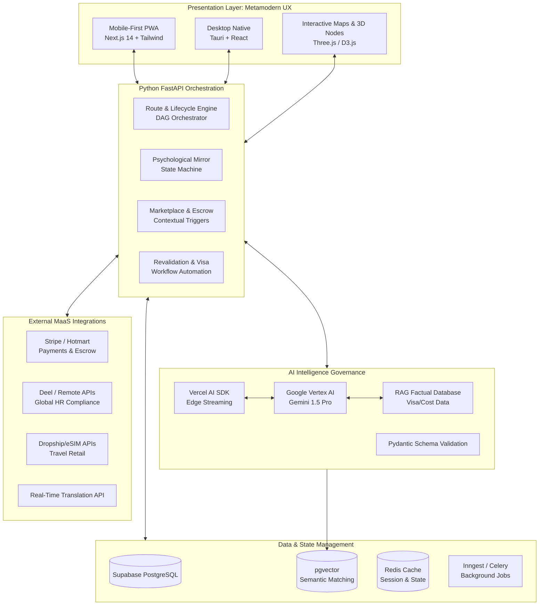

# Olcan Compass V2: Master Product Requirements Document (PRD)
**Target:** AI Developer Handover & Specification Guide
**Methodology:** McKinsey MECE (Mutually Exclusive, Collectively Exhaustive) & Mindmap Structuring
**Status:** V1 is live (Prod). V2 development requires building *upon* this foundation.

---
This is the granular, execution-ready feature specification for the Olcan Compass V2 Super App. As a Systems Architect and PE Analyst, this blueprint bypasses generic SaaS descriptions and maps exact user inputs to algorithmic outputs, linking the Rust/Wasm frontend (FE) components directly to the Python/FastAPI backend (BE) logic.

The architecture relies on the **Metamodern Experience Design (MMXD)** philosophy, utilizing interactive, high-fidelity components to lower cognitive load while capturing deep behavioral telemetry.

---

### 1. The Identity & Diagnostic Engine (The Mirror)

*Replaces the traditional "sign-up form" with a dynamic psychological and financial calibration sequence to establish the user's operational baseline.*

* 
**Input:** * Financial sliders (Current BRL income vs. Target USD/EUR).

* Likert-scale responses to behavioral proxy scenarios (e.g., "If an application is rejected, my first instinct is to...").

* Self-reported timeline constraints (e.g., "< 6 months" vs. "12+ months").

* 
**Output:** * The user's defined "Fear Cluster" (Competence, Rejection, Loss, Irreversibility).

* A dynamically generated "Archetype Profile" (e.g., "Structured High Confidence" or "High Anxiety High Potential").

* **Front-End Component (Rust/Wasm):** * **The 3D Calibration Matrix:** A fluid, WebGL-rendered radar chart (using Three.js) that morphs in real-time as the user answers questions.
* Instead of static radio buttons, users drag liquid sliders to balance their priorities (e.g., Prestige vs. Cost).

* 
**Back-End Logic (Python/FastAPI):** * Inputs hit the `PsychProfileService`.

* The deterministic scoring engine computes the `confidence_index`, `anxiety_score`, and `discipline_score`.

* The DB stores this in the `user_psych_profile` table and emits a `PsychProfileCreatedEvent` to configure the UI's tone globally.

### 2. The Strategic Route Engine (The Oracle)

*A visual, interactive roadmap that calculates the most statistically viable path based on the user's resources, replacing static checklists.*

* 
**Input:** * Selection of macro-goals (Job, Scholarship, Nomad).

* User's declared bandwidth (e.g., "< 2 hours a week").

* 
**Output:** * A Directed Acyclic Graph (DAG) of necessary milestones.

* The **"Cost of Inaction" (COI) Metric:** A live financial calculation showing exactly how much future earning potential is lost per day of delay.

* **Front-End Component (Rust/Wasm):** * **The Topographical Map:** An interactive, pan-and-zoom SVG node map.
* 
**Algorithmic Pruning Animation:** If the user lowers their budget slider, highly expensive "nodes" (e.g., US Private Universities) physically crumble or grey out on the map, preventing them from exploring dead ends.

* **The Ticking Odometer:** A prominent, animated number counter displaying the COI metric in real-time to trigger urgency.

* 
**Back-End Logic (Python/FastAPI):** * `pgvector` executes a Cosine Similarity match between the user's vector and the `opportunity_registry`.

* The `Dynamic Sprint Orchestrator` chunks the DAG into manageable "Micro-Sprints" (max 2 tasks) if the user's bandwidth is marked as `CONSTRAINED`.

### 3. The Artifact Forge (The Build/Write Engine)

*A high-focus, integrated IDE for crafting international assets (CVs, Motivation Letters) with real-time AI guardrails.*

* **Input:** * Raw text keystrokes.
* Context selection (e.g., "Target: German Engineering Firm").

* 
**Output:** * Live structural evaluation (Clarity, Specificity, Emotional Resonance).

* The real-time `Olcan Score` (0-100).

* 
**Front-End Component (Tiptap + React/Rust):** * **Distraction-Free Editor:** A clean, Notion-like block interface.

* **The Telemetry Typewriter:** A sleek right-hand sidebar. As the user types, a blinking cursor streams the AI's "thought process" (e.g., *"Analyzing keyword density for German ATS..."*).

* 
**Semantic Highlighting:** Fluff or clichés are highlighted in orange; strong, quantifiable metrics glow green.

* **Back-End Logic (Vertex AI + Pydantic):** * Text is sent asynchronously to the Python AI service.
* Gemini 1.5 Pro analyzes the text strictly against RAG-injected destination rules.

* The output is forced through a Pydantic schema (`{"clarity_score": int, "improvement_actions": list}`) before being piped back to the UI via WebSockets.

### 4. The Performance Simulator (The Interview Engine)

*A stress-testing environment designed to measure verbal resilience and structural articulation, moving beyond simple text prompts.*

* 
**Input:** * Voice/Text responses to timed questions.

* Toggles for "Time Pressure Mode" and "Strict Evaluation".

* 
**Output:** * Scores on `confidence_projection`, `delivery_score`, and `hesitation_index`.

* **Front-End Component (React/Wasm):** * **The Pressure Matrix:** A split-screen UI. On the left, the question prompt and a decreasing progress bar. On the right, a live EKG-style waveform that tracks the user's pacing and pauses.
* 
**Post-Session Radar:** A visual breakdown comparing the user's performance against the benchmark required for their specific route.

* **Back-End Logic (Python/FastAPI):** * Audio is processed via STT (Speech-to-Text).
* The system calculates the `resilience_index` based on how the user handles escalating difficulty.

* If the user's `interview_anxiety_score` is critically high, the system automatically triggers a Marketplace event.

### 5. Contextual Arbitrage & Escrow (The Marketplace)

*A high-margin B2B2C layer that monetizes user friction by offering immediate, vetted human intervention exactly when they stall.*

* 
**Input:** * Implicit: The system detects a user has been stalled on a node for >72 hours.

* Explicit: User clicks the "I need a human here" button inside the Artifact Forge.

* 
**Output:** * A highly targeted recommendation for 3 vetted providers (e.g., Sworn Translators, Tech Interview Coaches).

* A pre-packaged "Mentor Brief" summarizing the user's archetype and exact blocker.

* **Front-End Component (MMXD UI):** * **The Intervention Drawer:** A frosted-glass drawer slides out contextually. It does not feel like an ad; it is framed based on the user's psych profile (e.g., if highly anxious, it reads "Targeted support may accelerate improvement", not "You need help").

* 
**1-Click Escrow Booking:** Integrates Stripe checkout directly in the drawer.

* 
**Back-End Logic (Inngest + PostgreSQL):** * Event-driven architecture: `ApplicationStalledEvent` or `LowScoreEvent` is caught by the worker.

* The Marketplace service queries `pgvector` to find providers matching the `route_specialization` and `service_type`.

* Stripe initiates a hold on funds, updating the `booking_status` state machine, releasing funds only upon milestone completion.

### 6. The "First 48 Hours" Supply Drop (E-Commerce Integration)

*Captures the final transactional value of the relocation phase.*

* 
**Input:** * Route status shifts to `RELOCATING`.

* Target destination (e.g., "London, UK").

* **Output:** * A curated retail feed of essential physical and digital survival items.
* **Front-End Component:** * **The Survival Carousel:** A visually rich, horizontal scrolling component at the end of the Route Map. It displays 3D-rendered products: Global eSIMs, Universal Adapters, and specific Infoproducts (e.g., "UK NHS Onboarding Guide").

* **Back-End Logic:** * Headless commerce API integration. Queries the `digital_products` table based on `route_type_nullable`  and fetches relevant external affiliate links (e.g., Airalo, Amazon) mapped to the user's destination.
---

## 1. Executive Summary & Strategic Objective

The objective of Olcan Compass V2 is to transition from a single-player "Personal Development Tracker" into a comprehensive **Global Mobility as a Service (MaaS) Super App**. We are engineering a localized monopoly on internationalization.

By mapping the entire lifecycle of a professional or family relocating abroad, Compass V2 systematically eliminates information asymmetry, logistical friction, and financial risk. It is a "Command Center" that bundles high-margin SaaS algorithms with productized bureaucratic services, AI-driven asset generation, and a vetted human-in-the-loop marketplace.

---

## 2. Product Architecture: The MECE Service Ecosystem

To ensure no operational overlaps and exhaustive market capture, the application's feature set is categorized into five distinct verticals.

### Vertical A: The Intelligence & Orchestration Core (SaaS)

*The foundational brain that locks users into the ecosystem via proprietary data analysis.*

* **Algorithmic Strategic Routing (The DAG Engine):** Replaces static checklists with a Directed Acyclic Graph (DAG). Routes (e.g., "Developer to Germany" vs. "Family to Canada") dynamically recalculate based on macroeconomic shifts, user budget, and skill acquisition.
* **Risk & Capital Calculus:** Live dashboards calculating the opportunity cost of delays. Calculates the dynamic **Certainty Score**, modeled conceptually as:
$C_s = P(V) \times \left(1 - \frac{G_f}{C_t}\right) \times R_i$
*(Where $P(V)$ is Visa Probability, $G_f$ is Financial Gap, $C_t$ is Total Target Capital, and $R_i$ is the Behavioral Readiness Index).*
* **Psychological Profiling:** Initial and continuous behavioral assessments to adapt the UI's tone, ensuring the user remains in a state of productive execution rather than anxiety paralysis.

### Vertical B: Autonomous AI Agents (Digital Labor)

*High-margin, instant-delivery services that solve immediate skill and language gaps.*

* **The Artifact Forge (Context-Aware Drafting):** A distraction-free workspace for crafting ATS-compliant resumés, academic SoPs, and cover letters. Operates via a "Copilot" model, strictly adhering to destination-country standards.
* **Adaptive Performance Simulator:** AI-driven mock interviews (behavioral, technical/coding, and academic defense). It utilizes voice-to-text to measure hesitation indices and vocabulary richness, escalating difficulty based on real-time success.
* **Real-Time Contextual Translator:** A WebRTC-powered overlay for live calls (e.g., with foreign recruiters or landlords). Provides simultaneous transcription and suggested translated replies to bridge immediate language deficits.

### Vertical C: Bureaucratic Arbitrage & Fulfillment (Concierge BPO)

*Transforming terrifying legal/bureaucratic hurdles into one-click digital purchases.*

* **Credential & Diploma Revalidation Pipeline:** End-to-end tracking for global credentialing (WES, NARIC). Users upload raw documents; the system outputs legally compliant dossiers.
* **Sworn Translation & Notary Hub:** Automated optical character recognition (OCR) of vital documents routed to vetted sworn translators, delivered digitally with blockchain verification.
* **Cross-Border Financial Setup:** 1-click services to open offshore LLCs, multi-currency bank accounts, and file "Definitive Exit" tax declarations in the home country.
* **Visa Application Processing:** Automated form-filling and legal triage for specific visa classes (Digital Nomad, EB2-NIW, Tech Visas).

### Vertical D: The Human & Physical Ecosystem (Marketplace & E-Commerce)

*Capturing transactional value at the point of greatest need without holding inventory.*

* **B2B2C Agency & Mentor Matchmaking:** When a user stalls on the DAG for >72 hours, contextual triggers surface 3 vetted professionals (e.g., PhD advisors, immigration lawyers, exchange agencies). Transactions are held in Escrow.
* **The "First 48 Hours" Supply Drop (E-commerce):** Direct sales and affiliate dropshipping of physical relocation necessities (Global eSIMs, universal power adapters, TSA-approved luggage).
* **Infoproduct Hub:** Hyper-niche digital playbooks (e.g., "Renting in Berlin without a Schufa", "UK NHS Onboarding").

### Vertical E: Enterprise & Institutional Scale (B2B)

*Monetizing aggregated, anonymized user data and structural pipelines.*

* **Corporate Relocation Dashboard:** Multinational HR teams buy seats to monitor the visa readiness and settlement psychological health of relocated employees.
* **University/Recruiter Pipeline Aggregator:** Foreign institutions pay for qualified lead generation of structurally and financially pre-vetted candidates.

---

## 3. Technical Architecture & System Design

To support a Super App of this magnitude, the architecture must transition from a monolithic structure to a highly scalable, event-driven modular monolith.

### 3.1. Frontend Presentation Layer

* **Framework:** Next.js 14 (App Router). Server Components for SEO-heavy public landing pages; Client Components for complex authenticated states.
* **Mobile-First PWA:** The core app must be fully installable as a Progressive Web App for on-the-go triaging and media consumption.
* **Desktop Native (Optional phase):** Utilize Tauri + React for deep-focus environments (The Artifact Forge) and heavy multi-window research.
* **Visualizations:** Three.js / WebGL for rendering the 3D topographical route maps and the skill gap networks.

### 3.2. Backend API & Orchestration

* **Core Engine:** Python (FastAPI). Chosen for its superiority in handling the mathematical modeling (Economics Engine) and AI orchestration.
* **Background Jobs & Events:** Transition to **Inngest** or **Trigger.dev** (TypeScript/Serverless) for event-driven orchestrations (e.g., listening for a "Task Overdue" event to trigger an email or surface a marketplace mentor).

### 3.3. Data & State Management

* **Primary Database & Auth:** **Supabase (PostgreSQL)**. Must utilize Row Level Security (RLS) natively to ensure absolute data privacy between B2C users, Marketplace Mentors, and B2B HR accounts.
* **Semantic Search:** **pgvector** extension inside Supabase. Used to map User Vectors against Opportunity Vectors for high-probability matching.
* **State:** Zustand for client-side state; React Query/tRPC for server-state caching.

### 3.4. AI Intelligence Governance

* **Streaming & Abstraction:** **Vercel AI SDK** utilized at the Edge to stream responses directly to the client, preventing long loading states.
* **Core Models:** Google Vertex AI (Gemini 1.5 Pro) for complex reasoning and context windows; specialized smaller models for fast classification tasks.
* **Strict Schema Validation:** AI *never* outputs raw text directly to the UI for critical logic. Python middleware uses **Pydantic** to enforce strict JSON schema outputs.
* **RAG Factual Database:** AI is sandboxed. It must fetch visa requirements, deadlines, and cost-of-living data from a curated Retrieval-Augmented Generation (RAG) database, completely eliminating hallucination risks on legal matters.

---

## 4. UX & Interface Standards: Metamodern Design (MMXD)

The Super App must visually communicate "institutional trust" while remaining highly engaging. It must alleviate the user's cognitive load.

* **Aesthetic Identity ("Clinical Boutique"):** * Transition away from generic SaaS flat-design or fatiguing Cyberpunk dark modes.
* Use a "Premium Light" theme: Cream backgrounds, Moss Green primary actions, Charcoal typography.
* Use subtle CSS noise overlays to give a tactile, editorial magazine feel.

* **The Command Center (Progressive Disclosure):**
* Dashboard must *never* dump data. It utilizes the "Next Domino" philosophy: The user logs in and sees exactly ONE high-fidelity, un-ignorable card detailing their immediate next action, flanked by live widgets showing their Certainty Score and Financial Gap.

* **Interactive Components (The "Cool & Pretty" Factor):**
* *The Topographical Route:* A 3D rendered path where users can physically scroll through their milestones.
* *The Diagnostic Shuffler:* Glassmorphic cards that rotate via spring-physics (Framer Motion) to display readiness metrics.
* *Telemetry Typewriter:* During AI document generation, a sleek sidebar displays the AI's "thought process" in real-time (e.g., "Aligning to German syntax...", "Checking character limits...").

---

## 5. Development Phasing for Next AI Agent

To the AI Developer/Agent receiving this document, execute the build in the following strict order to ensure architectural integrity:

1. **Phase 1: Database & Identity Scaffold:** Provision Supabase. Establish the complex relational schema linking `Users`, `Routes`, `Nodes (Tasks)`, and `Escrow_Transactions`. Implement RLS.
2. **Phase 2: The DAG Routing Engine:** Build the Python FastAPI logic that calculates the critical path for users based on node weights (time/cost). Ensure graph updates trigger recalculations of the Certainty Score.
3. **Phase 3: The Next.js Command Center:** Build the Metamodern UI. Implement the single "Next Domino" dashboard and the 3D WebGL route visualizer.
4. **Phase 4: AI Autonomous Agents:** Implement Vercel AI SDK and the Artifact Forge. Enforce Pydantic JSON schemas on all Vertex AI responses.
5. **Phase 5: Marketplace & Integrations:** Wire up Stripe Connect for escrow payments, and build the event-driven triggers that surface marketplace providers when users stall.

---

Here is the comprehensive Backend System Design and Architectural Blueprint for the Olcan Compass V2 Super App. This document serves as the absolute technical specification for the backend engineering team, detailing the database schemas, API module boundaries, event-driven orchestration, and the AI governance pipeline.

To architect Olcan Compass V2 as a "Deterministic Risk & Capital Command Center," we must mathematically quantify the system. This is no longer a standard SaaS application; it is an **Algorithmic Labor Mobility Operating System**.

Below is the exhaustive mathematical assessment of the system's state space, the core algorithmic formulas driving the backend, and the calculated inventory of all screens, UI variations, and interactive components required for full deployment.

---

### 1. The Mathematics of the State Space (Combinatorics)

To understand the UI variations the frontend must handle, we must calculate the exact number of contextual states the system can generate. The Adaptive Psychological Mirror and the Dynamic Sprint Orchestrator ensure no two users see the exact same dashboard.

**The State Variables:**

* 
**Routes ($R$):** 5 (Scholarship, Job Relocation, Research/PhD, Startup Visa, Exchange).

* 
**Mobility States ($M$):** 6 (Exploring, Preparing, Applying, Awaiting, Iterating, Relocating).

* 
**Psychological States ($P$):** 5 (Uncertain, Structuring, Building_Confidence, Executing, Resilient).

* 
**Subscription Tiers ($T$):** 4 (Lite/Free, Core, Pro, Intensive/Premium).

* 
**Kinetic Bandwidth ($B$):** 3 (Constrained <2h, Moderate 2-5h, Abundant 5h+).

* 
**Target Resolution ($Tr$):** 3 (Nebulous, Directional, Locked).

**Total Dashboard Permutations Calculation:**
The absolute number of unique state configurations the Next.js/Rust frontend must dynamically render is:

$$Total\_States = R \times M \times P \times T \times B \times Tr$$

$$Total\_States = 5 \times 6 \times 5 \times 4 \times 3 \times 3 = \mathbf{5,400 \text{ Unique UX States}}$$

Every time a user logs in, the FastAPI backend evaluates these 5,400 possibilities and serves a specific `PsychInteractionConfig` payload  to adapt the UI's tone, pacing, and visible data.

---

### 2. The Core Algorithmic Formulas (Backend Economics Engine)

The following mathematical models must be coded into the Python FastAPI orchestration layer to drive the interactive UI components.

A. The Certainty Score ($C_s$) 
The probability of a user's success, updated dynamically upon milestone completion:

$$C_s = P(V) \times \left(1 - \frac{G_f}{C_t}\right) \times R_i$$

* $P(V)$: Base historical probability of the selected Visa/Route.
* $G_f$: Financial Gap (Target Capital minus Current Capital).
* $C_t$: Total Target Capital required for the route.
* $R_i$: Behavioral Readiness Index (derived from the Psych Engine).

B. Opportunity Cost of Inaction ($COI$) 
The daily financial loss metric displayed on the dashboard's "Ticking Odometer":

$$COI_{daily} = \frac{(S_{target} \times FX_{rate}) - S_{current}}{365}$$

* $S_{target}$: Annual salary/stipend in the target country (USD/EUR).
* $S_{current}$: Current domestic annual salary (BRL).
* $FX_{rate}$: Real-time exchange rate fetched via API.

C. Dynamic Readiness Score ($R_{score}$) 
Calculates if the user is structurally ready to submit an application:

$$R_{score} = \left( \sum_{i=1}^{n} w_i \times M_i \right) \times \left(1 - P_{penalty}(T_c)\right)$$

* $w_i$: The specific weight of dimension $i$ (e.g., Language, Finances).
* $M_i$: The completion status of milestones within that dimension.
* $P_{penalty}(T_c)$: Exponential penalty applied if the deadline (Timeline Compression, $T_c$) is critically close.

D. Provider Effectiveness Index ($PEI$) 
The algorithmic ranking for the B2B2C Marketplace:

$$PEI = \frac{\sum (R_{post} - R_{pre})}{N_{sessions}}$$

* Measures the average delta in a user's Readiness Score ($R_{post} - R_{pre}$) directly resulting from a session with a specific mentor.

---

### 3. Exhaustive Screen & Modal Inventory (148 Total Elements)

To accommodate the engine architectures and state permutations, the frontend requires **148 distinct screens and modals**.

#### 3.1. Public & Auth Layer (25 Screens)

* 
**Public (15):** Landing, How it Works, Route Explorer, Assessment Teaser, Success Stories, Marketplace Preview, Pricing, B2B/Institutional, Provider Landing, FAQ, Blog, About, Legal, 404/500 Errors, Waitlist.

* 
**Auth (10):** Login, B2C Signup, Provider Signup, Org Invite Signup, Password Reset (Request + Confirm), Email Verification, MFA Verification, Session Expired, Reauthentication Modal.

#### 3.2. Core Engines (62 Screens)

* 
**Psychological Onboarding (12):** Intro, Context Calibration, Confidence Block, Risk Block, Discipline Block, Decision Pattern Block, Interview Anxiety Block, Goal Clarity Block, Financial Stress Block, Summary Transition, Results, Route Prompt.

* 
**Home Dashboard (1):** 1 modular screen rendering the 5,400 states dynamically.

* 
**Route Domain (11):** Route Selection, Creation Config, Overview, Milestone Group View, Milestone Detail, Dependency Graph View, Timeline, Risk Analysis, Iteration, Multi-Route Switcher, Route Settings.

* 
**Readiness Domain (9):** Overview, Dimension Detail, Gaps Ranked, Risk Analysis, Submission Gate, History/Trend, Scenario Simulation, Financial Viability, Institutional View.

* 
**Narrative Domain (11):** List, Document Setup, Editor (The Forge), Analysis, Version History, Comparison, Alignment Map, Competitiveness Estimate, Coach Mode, Export, Institutional View.

* 
**Interview Domain (11):** Intro, Configuration, Live Session (Simulator), Mid-Session Feedback, Results, Dimension Breakdown, Transcript, History, Difficulty Progression, Recommendation, Institutional View.

* 
**Application Domain (12):** List, Create, Detail, Document Link, Submission Gate, Confirmation, Tracking, Outcome, Rejection Recalibration, Acceptance Transition, Multi-App Dashboard, Institutional View.

#### 3.3. Marketplace, Monetization & Admin (41 Screens)

* 
**Marketplace (16):** Home, Contextual Modal, Category, Provider List, Provider Profile, Service Detail, Booking (Time, Confirm, Pay), Success, Management, Provider Dashboard, Service Config, Earnings, Review Submit, Institutional View.

* 
**Subscription (12):** Overview, Plan Compare, Contextual Upgrade, Checkout, Processing, Success, Downgrade, Cancellation, Reactivation, Usage Limits, Invoices, B2B Subscriptions.

* 
**Org/B2B (5):** Org Dashboard, Cohort List, Cohort Detail, Student List, Member Detail.

* 
**Admin (14):** Dashboard, Users, Organizations, Providers, Subscriptions, Transactions, AI Monitoring, Readiness Control, Feature Flags, Content, Tickets, System Health, Audit Logs, Data Export.

#### 3.4. Shared Modals (15 Modals)

* Confirmation, Destructive Action, Submission Gate, Upgrade, Contextual Recommendation, Deadline Warning, Feature Lock, Rejection Reflection, Success Celebration, Data Consent, Session Timeout, Error/Retry, Loading Overlay, AI Processing, Rate Experience.

---

### 4. Interactive Components Specification (Front-to-Back Matching)

To execute the Metamodern Experience Design (MMXD), the Next.js/Rust frontend requires highly specific, data-dense interactive components that pull directly from the FastAPI backend.

**1. The 3D Calibration Matrix (Psych Engine)**

* **Frontend:** A fluid, WebGL-rendered radar chart (Three.js). Users drag nodes (representing Risk, Budget, Speed) instead of clicking radio buttons.
* 
**Backend:** Pushes data to `POST /api/v1/psych/calibrate`, recalculating the `user_psych_profile` vector in real-time.

**2. The Topographical Route Map (Route Engine)**

* 
**Frontend:** A Directed Acyclic Graph (DAG) built with D3.js.

* **Backend:** Executes the `Algorithmic Pruning Animation`. If the user inputs "Budget < R$10k" , the FastAPI backend queries `pgvector`  and sends a WebSocket trigger. The frontend physically crumbles or greys out invalid nodes (e.g., US Private Universities) in real-time.

**3. The Diagnostic Shuffler (Readiness Engine)**

* 
**Frontend:** 3 overlapping glassmorphic cards utilizing `unshift(pop())` logic and Framer Motion spring-physics (cubic-bezier).

* **Backend:** Queries `GET /api/v1/readiness/gaps`. The cards dynamically display "Visa Probability", "Financial Gap", and "Narrative Coherence".

**4. The Telemetry Typewriter (Narrative Engine)**

* 
**Frontend:** Inside the Tiptap rich-text editor (The Forge). A right-hand sidebar displays a live, terminal-style feed with a blinking clay cursor.

* 
**Backend:** WebSockets stream the LLM's structured Pydantic JSON evaluation. It streams text like: *`"Analyzing keyword density for German ATS..." -> "Warning: Abstract phrasing detected in Paragraph 2."`*.

**5. The Pressure Matrix (Interview Engine)**

* **Frontend:** A split-screen layout. Left: AI interviewer and timer. Right: A live EKG waveform tracking speech pacing and pauses.
* **Backend:** Streams browser STT (Speech-to-Text) to Python. Calculates `delivery_score` and `hesitation_index`. If hesitation spikes, it emits a `HighInterviewAnxietyEvent`  to the Marketplace Engine.

**6. The Liquid Metal Intervention Drawer (Marketplace)**

* **Frontend:** A CSS conic-gradient, frosted-glass drawer that slides out when triggered.
* 
**Backend:** If a user stalls for >72 hours, Inngest triggers the `ApplicationStalledEvent`. `pgvector` matches 3 exact mentors. The drawer presents them with 1-click Stripe Escrow booking.

This architectural blueprint ensures that every psychological variable and mathematical formula explicitly dictates a corresponding UI element, creating a fully deterministic, self-correcting global mobility machine.
---

# 🛠️ System Design Document (SysDoc): Olcan Compass V2 Backend

## 1. High-Level Backend Topography

The backend operates as a **Modular Monolith** built on **Python FastAPI**. It is designed to be highly concurrent (using `asyncio`) to handle AI streaming and real-time WebRTC connections, while offloading heavy data processing and background triggers to a serverless event orchestrator (**Inngest**). State and persistence are managed by **Supabase (PostgreSQL + pgvector)**.

### 1.1 Infrastructure Stack

* **API Framework:** Python 3.11+ / FastAPI / Uvicorn
* **Database & Auth:** Supabase (PostgreSQL 15), `pgvector` for semantic search, Supabase Auth (GoTrue).
* **ORM / Query Builder:** SQLAlchemy 2.0 (Async) or Prisma Client Python.
* **Data Validation:** Pydantic V2 (Strict schema enforcement for both API and AI outputs).
* **Event Orchestration:** Inngest (TypeScript/Python SDK) for reliable, retryable background jobs.
* **Caching & Rate Limiting:** Redis (Upstash).
* **AI Gateway:** Google Vertex AI (Gemini 1.5 Pro/Flash), LangChain/LlamaIndex for RAG orchestration.

---

## 2. Database Architecture (Entity-Relationship & Vector Schema)

The database utilizes PostgreSQL with strict Row Level Security (RLS) policies. Here is the MECE schema breakdown.

### 2.1 Core Identity & Access Management (IAM)

* **`users`**: Extends Supabase `auth.users`.
* `id` (UUID, PK)
* `role` (Enum: B2C_USER, MENTOR, B2B_HR, ADMIN)
* `psych_profile` (JSONB: stores behavioral traits, risk tolerance)
* `financial_baseline_brl` (Decimal)
* `target_salary_usd` (Decimal)

* **`organizations`** (For B2B HR / Agencies):
* `id` (UUID, PK), `name` (String), `subscription_tier` (String).

### 2.2 The DAG Routing Engine (Directed Acyclic Graph)

Routes are not linear; they are branching graphs.

* **`route_templates`**: Master templates (e.g., "US EB2-NIW", "German Blue Card").
* **`nodes`**: The individual steps within a route.
* `id` (UUID, PK), `route_id` (FK)
* `title`, `description` (String)
* `node_type` (Enum: UPLOAD, AI_GENERATION, PAYMENT, MANUAL_CHECK)
* `dependencies` (JSONB: Array of `node_id`s that must be completed first).
* `weight_days` (Int: Estimated time to complete).

* **`user_route_state`**: The live instance of a user's progress.
* `user_id` (FK), `route_id` (FK), `current_node_id` (FK)
* `status` (Enum: LOCKED, ACTIVE, STALLED, COMPLETED)
* `certainty_score` (Decimal: Continuously updated probability of success)
* `started_at`, `stalled_since` (Timestamps).

### 2.3 Semantic Vector Tables (`pgvector`)

Used for AI matchmaking and RAG factual retrieval.

* **`opportunity_vectors`**: Visas, jobs, and university programs.
* `id` (UUID), `title` (String), `metadata` (JSONB)
* `embedding` (Vector: 1536 dimensions - e.g., OpenAI/Vertex embeddings of requirements).

* **`user_vectors`**: Periodically updated embeddings of the user's CV and skills.
* `user_id` (FK), `embedding` (Vector).

* **`rag_knowledge_base`**: Ground-truth data for AI to prevent hallucination.
* `id` (UUID), `chunk_text` (Text), `source_url` (String), `embedding` (Vector).

### 2.4 Marketplace & Escrow

* **`marketplace_services`**: Productized offerings.
* `id` (UUID), `provider_id` (FK to `users`), `service_type` (Enum: TRANSLATION, LEGAL, MOCK_INTERVIEW), `price_usd` (Decimal).

* **`escrow_transactions`**:
* `id` (UUID), `buyer_id` (FK), `provider_id` (FK), `stripe_pi_id` (String)
* `status` (Enum: HELD, RELEASED, DISPUTED).

---

## 3. FastAPI Service Boundaries (The Modular Monolith)

The backend is divided into isolated domains to allow future extraction into microservices if scaling demands it.

### Service 1: `engine_routing` (The Deterministic Oracle)

* **`POST /api/v1/routes/calculate`**: Traverses the `nodes` DAG using Topological Sorting. If a user updates their timeline or a macro-event occurs, this recalculates the critical path and outputs the "Next Domino" to the UI.
* **`GET /api/v1/routes/economics`**: Calculates the `opportunity_cost_daily`.
* *Logic:* `(Target Salary / 365) - (Current Salary / 365) = Daily Loss`. Updates the dashboard widget.

### Service 2: `engine_ai` (The Artifact Forge & Simulator)

* **`POST /api/v1/ai/generate-document`**: Accepts a draft and target country.
* *Pipeline:* Fetches target country standards from `rag_knowledge_base` -> Compiles Prompt -> Calls Vertex AI -> Validates against a Pydantic schema (`{"optimized_text": "...", "suggestions": [...]}`) -> Returns to client.

* **`ws://api/v1/ai/interview-stream`**: WebSocket connection for the Adaptive Performance Simulator. Streams STT (Speech-to-Text) from the frontend, evaluates hesitation/confidence via a lightweight NLP model, and returns the next AI interviewer question.

### Service 3: `engine_marketplace` (B2B2C Settlement)

* **`GET /api/v1/marketplace/contextual-match`**: Uses `pgvector` to run a Cosine Similarity search: `SELECT * FROM marketplace_services ORDER BY embedding <=> user_vector LIMIT 3;`.
* **`POST /api/v1/marketplace/escrow/fund`**: Integrates with Stripe Connect. Holds the user's funds in a connected account until the `node` status changes to `COMPLETED`.

---

## 4. Event-Driven Orchestration (Inngest)

We abandon Celery/Redis for complex long-running workflows in favor of **Inngest** to handle failures, retries, and step-functions gracefully.

### Workflow A: The "Stalled User" Trigger

1. **Event:** `route.node.status_changed` (Status: `STALLED` > 72 hours).
2. **Step 1 (Calculate Loss):** Inngest calls the Economics Engine to calculate how much money the user has lost in the last 72 hours.
3. **Step 2 (Matchmaking):** Queries the Vector DB for 3 relevant mentors/agencies capable of unblocking this specific node.
4. **Step 3 (Nudge Delivery):** Pushes an actionable notification to the frontend and via email: *"You've lost R$450 in future earnings waiting on this translation. Hire a sworn translator now to unblock this step."*

### Workflow B: Macro-Economic Shock Recalculation

1. **Event:** `macro.policy.updated` (e.g., US announces H1B pause).
2. **Step 1:** Finds all users currently on the affected DAG route.
3. **Step 2:** Triggers the Routing Engine to dynamically prune the dead nodes and calculate an alternate route (e.g., Canada Tech Visa).
4. **Step 3:** Updates the `certainty_score` for all affected users and flags the UI to present a "Pivot Nudge" upon their next login.

---

## 5. Security & AI Guardrails

To protect the enterprise B2B data moat and maintain strict compliance:

* **Row-Level Security (RLS) in Supabase:**
* A B2B HR Manager querying the database can *only* see aggregated, anonymized progress data of their employees.
* SQL Policy Example: `CREATE POLICY view_own_data ON user_route_state FOR SELECT USING (auth.uid() = user_id);`

* **The AI "Air-Gap" (Schema Validation):**
* The LLM is highly unpredictable. We enforce an air-gap using **Pydantic** and **Instructor/LangChain**.
* If the AI returns a hallucinated visa requirement, the output will fail Pydantic validation (which compares it against allowed enum values from the RAG DB). The backend automatically triggers an internal `retry` with a strict error message to the LLM before ever sending a 500 error to the frontend.

* **PII Masking:** Before any user data (CVs, financial states) is sent to Vertex AI for document generation, a local lightweight NLP pipeline scrubs Personally Identifiable Information (names, exact addresses) and replaces them with tokens (`[USER_NAME]`), re-injecting them only when the response returns to the client.

This architecture ensures the Olcan Compass V2 backend is deterministic, highly scalable, and capable of abstracting immense geopolitical and bureaucratic complexity into a single, frictionless API for the frontend.
---

### I. The SaaS & AI Core (High Margin, Scalable Infrastructure)

This is the high-gross-margin anchor. It drives daily active usage and traps the user in the ecosystem by holding their data and psychological profile.

* 
**Algorithmic Pathway Orchestration:** Dynamic mapping of visas, scholarships, and jobs tailored to the user's operational capital.

* 
**The Artifact Forge (AI Document Prep):** Hyper-specialized AI engines for drafting ATS-optimized resumés, academic Statements of Purpose (SoPs), cover letters, and research proposals.

* 
**Adaptive Interview & Performance Simulator:** AI-driven mock interviews that escalate in difficulty. For developers, this includes live coding environment simulations; for academics, thesis defense simulations.

* **Real-Time Simultaneous Translation API:** An embedded tool for live networking calls, initial recruiter screenings, or agency negotiations. This lowers the immediate language barrier, allowing users to secure opportunities while their language skills are still developing.
* 
**Risk & Feasibility Calculators:** Live dashboards calculating the exact financial gap and "Certainty Score" for a chosen route.

### II. Bureaucratic & Legal Arbitrage (BPO & Concierge Services)

*This vertical monetizes the highest-friction, highest-anxiety steps. It transforms complex legal hurdles into one-click, premium-priced productized services.*

* **Credential & Diploma Revalidation Concierge:** End-to-end management of diploma equivalence processes (e.g., WES in the US/Canada, NARIC in the UK, or specific European university protocols).
* 
**Sworn/Certified Translation Hub:** An automated pipeline where users upload domestic documents (transcripts, birth certificates) and receive legally certified translations via marketplace partners.

* **Cross-Border Tax & Financial Setup:** Services for opening offshore LLCs, filing "definitive exit" tax declarations in the home country, and establishing foreign bank accounts/credit histories prior to arrival.
* **Visa Application Processing:** Legal review and automated form-filling for complex visas (e.g., Nomad visas, EB2-NIW, European Blue Cards).

### III. The Human-in-the-Loop Marketplace (Commission-Based)

A vetted ecosystem of providers that unlocks bottlenecks. The app takes a 15-30% platform take-rate without bearing the cost of service delivery.

* **B2B2C Agency Matchmaking (The Family Niche):** Families looking for teen exchange programs or language schools input their budget and goals. The app matches them with 3 vetted agencies, taking a lead-generation or conversion fee.
* 
**Technical & Niche Coaching:** Vetted FAANG developers offering live mock interviews; academic researchers reviewing PhD proposals; immigration lawyers offering 30-minute triage calls.

* 
**Expat Psychological Support:** Network of licensed therapists specializing in relocation anxiety, culture shock, and imposter syndrome—delivered via telehealth.

* **Settlement & Relocation Brokers:** Connecting users with local real estate brokers, pet relocation specialists, and international moving companies.

### IV. E-Commerce & Digital Retail (Affiliate & Direct Sales)

*This converts the app into a true "One-Stop-Shop," capturing the final transactional value before and during the physical move.*

* **The "First 48 Hours" Physical Shop:** A curated e-commerce store (via dropshipping or Amazon affiliate integrations) selling global survival kits: universal power adapters, TSA-approved luggage, power banks, and winter gear.
* **Telecom & Connectivity:** Direct sales of global eSIMs (e.g., Airalo partnerships) so users land with immediate internet access.
* 
**Infoproduct & Playbook Hub:** A digital storefront for hyper-specific guides (e.g., "The Creator Finance OS", "How to Rent in Berlin without a Guarantor", "UK Healthcare Onboarding").

* **Flight & Insurance Aggregation:** Integrated booking for one-way international flights and mandatory expat/student health insurance.

### V. B2B & Institutional Monetization (Enterprise LTV)

Transforming individual consumer data into institutional infrastructure.

* 
**Corporate Relocation Command Center:** Multinational HR departments buy "seats" to track the visa and settlement readiness of their relocated employees.

* 
**University Pipeline Aggregator:** Foreign universities pay for qualified lead generation of structurally and financially ready students from the Global South.

---

### 💡 PE Investment Rationale: Why This Strategy Wins

From a financial analysis perspective, transforming Compass into this Super App creates a highly defensible **Ecosystem Lock-In**:

1. **Negative Churn / High Expansion Revenue:** A user might enter via a $5/month app subscription to use the Route Planner (SaaS). However, as they progress, they spend $300 on Sworn Translations (Marketplace), $1,500 on an Exchange Agency fee (B2B2C Lead Gen), and $50 on an eSIM and Adapter (E-commerce). The LTV expands exponentially without additional Customer Acquisition Cost (CAC).
2. 
**Proprietary Data Moat:** By processing diplomas, tax setups, and agency matchmaking, Compass aggregates the most comprehensive dataset on Global South migration patterns, success rates, and capital flight. This enables predictive modeling that competitors cannot replicate.

3. **Counter-Cyclical Hedging:** If the tech job market crashes, the app pushes the Academic or Nomad routes. If families stop traveling due to FX rates, the app focuses on remote B2B developers. The diversity of the niches ensures robust, weather-proof revenue.

As a Private Equity Analyst and Lead Systems Architect, looking at the transition of Olcan Compass into a "Global Mobility as a Service" (MaaS) Super App, the imperative is to build an architecture that scales flawlessly while delivering a visceral, premium user experience. We are no longer building a simple SaaS; we are engineering a highly defensible, AI-driven ecosystem that orchestrates the financial, psychological, and logistical complexities of international relocation.

To achieve this, we must deploy a **Modular Monolith Architecture** powered by a Next.js 14 / Python FastAPI stack, heavily augmented by WebGL/WASM for high-fidelity interactive visualizations, and governed by strict Metamodern Experience Design (MMXD) principles.

Here is the exhaustive architectural blueprint, encompassing system design, AI orchestration, and the premium front-end visual components required to lock in users and dominate the market.

---

### I. The Architectural Canvas: Full System Orchestration

The system is divided into four distinct layers: The Presentation Layer (Mobile/Desktop), The Orchestration API, The AI/Intelligence Layer, and The MaaS Integration Ecosystem.

---

### II. Front-End & UX Strategy: Metamodern Experience Design (MMXD)

To justify premium pricing and soothe the immense anxiety of international relocation, the UI must violently depart from standard, sterile corporate software. We will utilize **Metamodern Experience Design (MMXD)**—blending clinical, high-tech data visualization with organic, human-centric aesthetics.

* 
**Aesthetic Identity ("Clinical Boutique"):** * **Palette:** Moss Primary (`#2E4036`), Clay Accents (`#CC5833`), Cream Backgrounds (`#F2F0E9`), and Charcoal text (`#1A1A1A`).

* 
**Typography:** "Plus Jakarta Sans" for tight, structural tracking, juxtaposed with "Cormorant Garamond" italicized for emotional/dramatic emphasis.

* 
**Visual Texture:** A global CSS Noise overlay (SVG turbulence at 0.05 opacity) to eliminate cheap, flat digital gradients, giving the app a premium, tactile magazine feel.

* **Mobile-First vs. Desktop Focus:**
* **Mobile:** Designed for rapid triaging, quick nudges, and consuming asynchronous mentorship videos. Uses "Bento Grids" to compartmentalize complex data into bite-sized, tap-friendly widgets.

* 
**Desktop (Tauri Native App):** Designed for "The Forge" (deep-focus document writing) and complex topographical map planning.

---

### III. Deep-Dive: Service Features & Interactive Components

For each pillar of the Super App, we must deploy "cool and pretty" interactive components that functionally reduce cognitive load while delivering the specific services you identified.

#### 1. The SaaS Core: Algorithmic Routing & Readiness

* **Interactive Topographical Route Map (D3.js/Three.js):**
* 
*The UX:* Instead of a boring checklist, the user's journey is rendered as a 3D topographical map. The user is a glowing node traversing a path. Dead-ends (e.g., a visa they cannot afford) crumble and fall away in real-time as they update their financial data.

* *The Tech:* Next.js streaming state updates to a Three.js canvas. `pgvector` computes cosine similarity between the user's profile and opportunity requirements, drawing the shortest path.

* **The Diagnostic Shuffler (Readiness Engine):**
* *The UX:* To display the "Certainty Score" and readiness gaps, we use a "Diagnostic Shuffler" UI. Three overlapping white glassmorphic cards cycle vertically with a spring-bounce transition (using GSAP). Labels read: "Visa Probability", "Financial Gap", "Narrative Coherence".

#### 2. Bureaucratic Arbitrage: Revalidation & Visa Concierge

* **The Artifact Forge (Tiptap + AI):**
* 
*The UX:* A distraction-free, Notion-like editor for CVs and Statements of Purpose. As the user types, a "Telemetry Typewriter" sidebar provides a live text feed from the AI (e.g., *"Optimizing German ATS keywords..."*) with a blinking clay cursor.

* 
*The Tech:* Python FastAPI backend evaluates text in real-time against the proprietary "Olcan Score" rubric, using Google Vertex AI to stream inline JSON suggestions back to the editor.

* **Revalidation Tracker Tracker:**
* *The UX:* A "Pizza Tracker" style visualizer for diploma revalidation and sworn translations. Users watch the document move through nodes: *Uploaded → Sworn Translation → Notary → Embassy Approval*.

#### 3. The Performance Simulator: Interviews & Translation

* **Adaptive Interview Environment:**
* *The UX:* A split-screen interface. On the left, the AI interviewer. On the right, a pulsing EKG waveform path that tracks the user's speech pacing, hesitation index, and "Confidence Projection" in real-time.

* *The Tech:* Audio-to-text processing via browser APIs, sent to the Python backend to calculate delivery scores. The difficulty escalates dynamically based on the user's real-time resilience index.

* **Real-Time Simultaneous Translation Widget:**
* 
*The UX:* A sleek, floating frosted-glass overlay (Glassmorphism, backdrop-filter: blur) that can be dragged across the screen during live recruiter calls. It provides live captioning and suggested translated responses.

#### 4. The Human-in-the-Loop Marketplace (B2B2C)

* **Contextual Mentor Matchmaking:**
* 
*The UX:* No static provider directories. If the system detects a user has stalled for 3 days on a visa application, a subtle "Liquid Metal" button appears (using CSS conic-gradients). Clicking it opens a drawer suggesting exactly 3 vetted immigration lawyers, with a 1-click escrow booking.

* *The Tech:* Event-driven triggers. `ApplicationStalledEvent` is fired by Inngest, caught by the Marketplace Engine, which queries Postgres for providers tagged with the specific bottleneck.

#### 5. E-Commerce & Digital Retail

* **The "First 48 Hours" Supply Drop:**
* 
*The UX:* A beautiful, horizontal scrolling carousel integrated into the final "RELOCATING" phase of the route map. It displays 3D-rendered objects: eSIM cards, Universal Adapters, and winter gear.

* *The Tech:* Headless commerce APIs (e.g., Shopify or direct affiliate links) embedded directly into the Next.js frontend, allowing one-click purchase of physical goods necessary for their specific destination country.

---

### IV. AI Governance & Security (The Moat)

To function as a true B2B/Institutional product (selling to universities and global HR), the system must guarantee zero hallucinations and total data privacy.

* **Schema-Validated AI:** The AI layer never generates free text directly to the user. The Python middleware requests strict JSON schemas from Gemini Pro (e.g., `{"clarity_score": 72, "improvement_actions": ["..."]}`). If the AI breaks the schema, a "Retry & Correction Engine" forces it to fix the format before the frontend ever sees it.

* **RAG Only for Facts:** AI is barred from using its training data to answer visa or cost questions. All factual data is injected via Retrieval-Augmented Generation (RAG) from a strictly maintained, human-curated PostgreSQL database.

* 
**Row-Level Security (RLS):** Implemented natively in Supabase to ensure that when B2B organizations (agencies/universities) log in, they see anonymized cohort heatmaps, but cannot access individual student CVs or psychological data without explicit, tokenized consent.

### V. Strategic Conclusion for Market Entry

By deploying this architecture, Olcan transcends being a mere "tool." It becomes an **Enterprise Mobility as a Service (MaaS)**.

You acquire users via the high-margin, scalable SaaS core (The Route Planner & AI Forge). You retain them through the Metamodern, psychologically safe UX. Finally, you aggressively expand their Lifetime Value (LTV) by capturing the transactions they *already have to make*—translators, visa lawyers, flights, and eSIMs—directly within your marketplace and e-commerce layers.

Would you like to drill down into the specific Next.js/React component structures for the 3D Topological Maps, or the Python/FastAPI logic for the Event-Driven Marketplace triggers?

## 1. STRATEGIC CONTEXT & V1 FOUNDATIONAL BASELINE

### 1.1 The Pre-Migrant Dilemma (2024 Reality)
Based on 2024 global migration data, the core friction points leading to churn or failure are **not** merely psychological; they are logistical and financial:
1.  **Visa/Regulatory Friction:** Unpredictable timelines and sudden policy shifts.
2.  **Credential Friction:** The risk of underemployment and skills mismatch in the target market.
3.  **Capital Friction:** The cost of inaction (losing USD/EUR earning potential daily) versus the risk of local BRL capital depletion.

### 1.2 The V1 Reality (Current State)
*   **Infrastructure:** Monolithic Python FastAPI backend handling complex logic (Economics, AI prompt routing, Escrow) via Celery/Redis background jobs. Postgres Database.
*   **Frontend:** Vite + React SPA (violating the intended Next.js 14 architecture). No server-side rendering (SSR), crippling public-facing SEO funnel.
*   **UI/UX:** MMXD Design system relies heavily on "Void/Dark" mode with neon accents. Generates visual fatigue and lacks the premium "trust" aesthetics required for career/financial decisions. High cognitive overhead (e.g., exposing all tasks at once, "Map vs. Forge" toggles).

### 1.3 The V2 Objective (Target State)
V2 must pivot from a **"Personal Development Tracker"** to a **"Deterministic Risk & Capital Command Center"**. It must act as a white-glove concierge, abstracting the complex backend data into singular, safe, and clear atomic actions for the user.

---

## 2. SYSTEM ARCHITECTURE MIGRATION (MECE Pillar 1)

*The foundation must be modernized to support B2C scale, SEO, and real-time interactions.*

### 2.1 Frontend: Next.js 14 App Router Pivot
*   **Requirement:** Abandon the Vite SPA. Migrate the entire `apps/web` to Next.js 14.
*   **Routing Structure:**
    *   `(public)`: Server Components for SEO. Marketing landing page, "How it Works", Trust Pillar cards.
    *   `(auth)`: Protected routes.
*   **State Management:** Retain Zustand for client state, but move data fetching to Next.js Server Actions or tRPC/React Query to eliminate SPA waterfall loading.

### 2.2 Backend: Decentralizing the Monolith
*   **Database & Auth:** Migrate user auth completely to **Supabase**. Implement Row Level Security (RLS) to enforce data privacy natively at the DB level, reducing Python boilerplate.
*   **Background Jobs:** Migrate away from Redis/Celery for the "Economics Engine." Adopt a TypeScript-native serverless orchestrator like **Inngest** or **Trigger.dev**.
*   **AI Abstraction:** Retire custom Python prompt linking. Implement the **Vercel AI SDK** within Next.js Edge Functions for streaming conversational AI features directly to the client.

---

## 3. UI/UX: COGNITIVE SAFETY & TRUST (MECE Pillar 2)

*The interface must overcome Information Asymmetry and Execute Paralysis.*

### 3.1 Premium "Safe-Harbor" Aesthetics
*   **Theme Shift:** Move away from pure "Void" dark mode. Introduce a "Premium Light" or high-contrast "Day Mode" as the default. Think Private Wealth Management, not Cyberpunk.
*   **Typography & Whitespace:** Increase negative space by 40%. Use strict hierarchical typography (e.g., Inter/Outfit) to guide the eye.
*   **Micro-interactions:** Use Framer Motion for subtle state changes (e.g., loading skeletons, checkmark morphs), eliminating jarring page loads.

### 3.2 The "Command Center" Dashboard (Progressive Disclosure)
*   **Requirement:** Abolish the current dashboard data-dump.
*   **The "Next Domino" Philosophy:** The user should log in and see exactly **ONE** massive, un-ignorable card detailing their *Immediate Next Task*.
*   **Key Metrics Display:**
    *   *The Target Delta:* Live widget showing current BRL salary vs. Target Market Salary (adjusted for Purchasing Power Parity).
    *   *The Certainty Score:* A dynamic probability percentage (%) of visa/route success based on completed milestones.

### 3.3 Conversational Workspaces (No More Modals)
*   **Narratives & Interviews:** Do not use popup modals for heavy text editing. Provide a full-screen, distraction-free "Focus Editor".
*   **AI Integration:** Instead of a blank `Textarea`, initiate drafting via a 3-question AI chat interface that generates the first draft.

---

## 4. PRODUCT MECHANICS: THE EXECUTION ENGINE (MECE Pillar 3)

*Translating the backend Economics Engine into behavioral nudges.*

### 4.1 Dynamic Risk-Adjusted Routing
*   **Current Flaw:** Routes are static checklists.
*   **V2 Requirement:** Branching Decision Trees. If a macro-economic variable shifts (e.g., US H1B processing delayed), the Route Engine must auto-calculate and propose a pivot (e.g., "Switching to Canada Express Entry increases success probability by 22% given current delays.").

### 4.2 The "Cost of Inaction" Nudge Engine
*   **Requirement:** Surface the `opportunity_cost_daily` calculation (already in the Python backend) to the center of the UI.
*   **Behavioral Trigger:** When a task is overdue, the UI must frame the delay financially: *"Pending: Document Translation. Delaying past Friday costs an estimated R$ 150/day in lost future earning potential."*

### 4.3 Seamless Marketplace Unblocking
*   **Requirement:** Deep integration of the Marketplace into the Route Planner.
*   **Flow:** If a user fails a step or stalls for >3 days, a "Get Expert Help" button appears contextually. Clicking it opens a drawer to instantly hire a vetted provider via Escrow, unblocking the task without leaving the Route context.

---

## 5. EXECUTION ROADMAP FOR NEXT AI AGENT

To the AI Developer picking up this PRD, execute the development in the following strict order to maintain system stability:

### Phase 1: Architectural Scaffolding (Weeks 1-2)
1. Initialize Next.js 14 App Router in parallel with the existing Vite app.
2. Connect Next.js to the existing Database via Supabase client.
3. Establish the `(public)` marketing funnel (Landing Page -> Value Prop -> Login) using Server Components.

### Phase 2: Core UX Pivot (Weeks 3-4)
1. Refactor `index.css` and Tailwind config to implement the "Premium Light" high-trust aesthetic.
2. Build the new "Command Center" Dashboard, hardcoding the "Next Domino" layout before hooking up live data.
3. Migrate the Onboarding Psych Assessment to the new visual standard.

### Phase 3: The Route & Engine Integration (Weeks 5-6)
1. Rebuild `MyRoutes.tsx` as a branching visual timeline. Default entirely to Forge Mode (focus view).
2. Wire up the Next.js frontend to the existing FastAPI endpoints for the Economics Engine (Opportunity Cost, Temporal Matching).
3. Surface the "Certainty Score" and "Cost of Inaction" metrics on the Dashboard.

### Phase 4: Conversational Spaces (Weeks 7-8)
1. Replace the Narrative CRUD modals with a full-screen, AI-assisted conversational editor.
2. Refactor the Interview Question Bank into an "AI Coach" chat interface utilizing the Vercel AI SDK.
3. Final E2E testing of the migration flow.

---
**End of PRD.**
