# Grafo de Conhecimento Olcan Compass (Final-Fidelity)

**Resumo**: Mapa visual multidimensional absoluto, integrando a Jornada do Usuário, a Operação Nexus, o Marketplace e a Visão Mestra de CEO com a estrutura de Arquivo Permanente.
**Importância**: Crítica (Bússola Global)
**Status**: Ativo
**Camada (Layer)**: Planejamento / Wiki
**Tags**: #grafo #wiki #obsidian #mermaid #masterview #highfidelity #segurança #economia #ia #archivo
**Criado**: 15/04/2026
**Atualizado**: 18/04/2026
**Atualizado**: 17/04/2026

---

## 🗺️ O Super-Mapa do Ecossistema (v2.5)

Este grafo representa o estado final da consolidação "Ground Truth" (Karpathy Technique), onde o conhecimento ativo está separado do histórico, mas acessível.

```mermaid
graph TD
    %% Centro Gravitacional
    User((Usuário Final)):::user_node
    
    %% Camada 1: Experiência Aura & Narrativa
    subgraph View_User [Vista do Usuário: Jornada & Forge]
        User --> Diagnostic[Diagnóstico Mirror]
        Diagnostic --> Archetypes[Arquétipos & Recombinação]
        User --> Forge[Narrative Forge]
        Forge --> Dossier[Dossier System]
        Dossier --> Hub[DossierHub]
        Dossier --> Export[Export Control]
        Dossier --> Timeline[Timeline View]
        Forge --> Guidance[Document Guidance]
        Forge --> Profile[Profile Integrator]
        Forge --> AIScoring[IA: Pillar 06]
        User --> TaskEngine[Motor de Tarefas / XP]
    end

    %% Camada 2: Operação Nexus & Dados
    subgraph View_Employee [Vista da Operação: Nexus]
        Nexus[Nexus Orchestrator] --> Agents[Agentes Especialistas]
        Agents --> Pipeline[Pipeline Automático]
        Pipeline --> DB_Ops[Operações / Pillar 02]
        Pipeline --> Runbook[Runbook / Pillar 00]
    end

    %% Camada 3: Inteligência Econômica & Marketplace
    subgraph View_Vendor [Vista Econômica: Marketplace]
        Vendor[Vendedor / Partner] --> Portal[Seller Portal]
        Portal --> Escrow[Escrow: Pillar 05]
        Portal --> CRM[Integração CRM]
        User --> Pareto[Simulador de Pareto]
        User --> OppCost[Custo de Oportunidade]
    end

    %% Camada 4: Gestão Mestra (O Cérebro)
    subgraph View_CEO [Vista do CEO: Master View]
        CEO[Olcan CEO] --> Matrix[Matriz de Comando]
        Matrix --> SuccessKPIs[Os 5 KPIs de Sucesso]
        Matrix --> Security[Segurança & Entitlements]
        Matrix --> Vision[PRD Master / Pillar 03]
    end

    %% Camada 5: Memória Permanente (O Arquivo)
    subgraph View_Archive [Pilar 10: Memória do Sistema]
        Archive[Arquivo Permanente] --> Skills[AGENT_SKILLS]
        Archive --> Reports[PHASE_REPORTS]
        Archive --> Legacy[LEGACY_PRDS]
        Archive --> Technical[LINT_AND_CONVENTIONS]
    end

    %% Conexões de Ground Truth
    AIScoring -.-> Vision
    OppCost --> Matrix
    Escrow --> SuccessKPIs
    DB_Ops -.-> Security
    Archive -.-> Nexus

    %% Estilização
    classDef user_node fill:#8B5CF6,stroke:#fff,stroke-width:4px,color:#fff,font-weight:bold
    style View_User fill:#f5f3ff,stroke:#8B5CF6
    style View_Employee fill:#ecfdf5,stroke:#10B981
    style View_Vendor fill:#fff7ed,stroke:#F59E0B
    style View_CEO fill:#fdf2f2,stroke:#EF4444
    style View_Archive fill:#f3f4f6,stroke:#374151
```

---

## 🏁 A Versão Definitiva
Este ecossistema de Wiki agora cobre:
1.  **Visão Mestra**: KPIs Reais e Matriz de Comando.
2.  **Inteligência Econômica & Narrativa**: O cérebro por trás dos resultados.
3.  **Visual Blueprint**: 27 telas de UI alta fidelidade.
4.  **Memória de Elite**: Arquivo categorizado e Mece.

---

## 🔗 Navegação Mestra por Wing

### 🏛️ 00_SOVEREIGN — Fonte da Verdade
- [[00_SOVEREIGN/Olcan_Master_PRD_v2_5]] — visão completa do produto
- [[00_SOVEREIGN/Verdade_do_Produto]] — estado real do produto (sem inflação)
- [[00_SOVEREIGN/Agent_Knowledge_Handbook]] — manual para agentes IA
- [[00_SOVEREIGN/Analise_Historiador_Nexus]] — contexto histórico e decisões
- [[00_SOVEREIGN/MemPalace_Migration_Spec]] — metodologia do wiki

### 🎯 01_Visao_Estrategica — O Porquê
- [[01_Visao_Estrategica/Visao_Mestra_CEO]] — dashboard executivo (4 quadrantes, 5 KPIs)
- [[01_Visao_Estrategica/Roadmap_Implementacao_v2_5]] — roadmap atual
- [[01_Visao_Estrategica/Carta_do_Projeto_Olcan_v2.5]] — pacto fundador do projeto
- [[01_Visao_Estrategica/Verdade_Final_v2_5]] — análise de gaps pré-lançamento

### 🏗️ 02_Arquitetura_Compass — O Como
- [[02_Arquitetura_Compass/Arquitetura_v2_5_Compass]] — arquitetura principal (hub técnico)
- [[02_Arquitetura_Compass/Referencia_de_API]] — referência de endpoints
- [[02_Arquitetura_Compass/Seguranca_e_Entitlements]] — segurança e permissões
- [[02_Arquitetura_Compass/Guia_de_Arquitetura_de_Stores]] — stores Zustand
- [[02_Arquitetura_Compass/Proximas_Tarefas_de_Codigo]] — tarefas imediatas de código

### 📦 03_Produto_Forge — O Quê
- [[03_Produto_Forge/PRD_Geral_Olcan]] — PRD geral (hub de produto)
- [[03_Produto_Forge/PRD_Master_Ethereal_Glass]] — design system e UI blueprint
- [[03_Produto_Forge/Spec_Narrative_Forge]] — spec da feature Forge
- [[03_Produto_Forge/Spec_Simulador_de_Entrevista]] — spec do simulador
- [[03_Produto_Forge/Spec_Dossier_System_v2_5]] — sistema de dossier completo (18/04/2026)
- [[03_Produto_Forge/Jornadas_do_Usuario]] — fluxos do usuário

### 🎮 04_Ecossistema_Aura — Gamificação
- [[04_Ecossistema_Aura/Mestre_de_Companions]] — sistema de companions
- [[04_Ecossistema_Aura/Estrategia_de_Gamificacao]] — estratégia de XP e aura
- [[04_Ecossistema_Aura/Especificacao_de_Arquitetos_OIOS]] — 12 arquétipos OIOS

### 💰 05_Inteligencia_Economica — Motor de Arbitragem
- [[05_Inteligencia_Economica/Spec_Inteligencia_Economica]] — escrow, Pareto, custo de oportunidade

### 🧠 06_Inteligencia_Narrativa — IA do Forge
- [[06_Inteligencia_Narrativa/Spec_Narrative_Forge]] — scoring de IA, detecção de clichês

### 🤖 07_Agentes_IA — Sistema Nexus
- [[07_Agentes_IA/Enciclopedia_Nexus_Agentes]] — catálogo de todas as divisões
- [[07_Agentes_IA/Catalogo_de_Agentes_Especialistas]] — personas (Valentino, Mary, Leon...)
- [[07_Agentes_IA/Estrategia_Nexus_Agentes]] — pipeline de 7 fases

### 🚀 00_Onboarding_Inicio — Execução
- [[00_Onboarding_Inicio/Plano_GoLive_v2_5_Abril_2026]] — plano de lançamento v2.5
- [[00_Onboarding_Inicio/Runbook_de_Deployment]] — runbook de deployment
- [[00_Onboarding_Inicio/Padroes_de_Codigo]] — padrões de código
