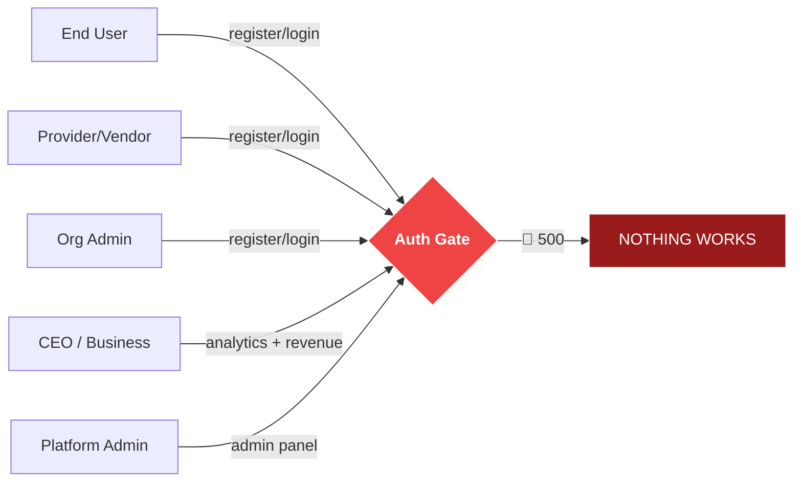
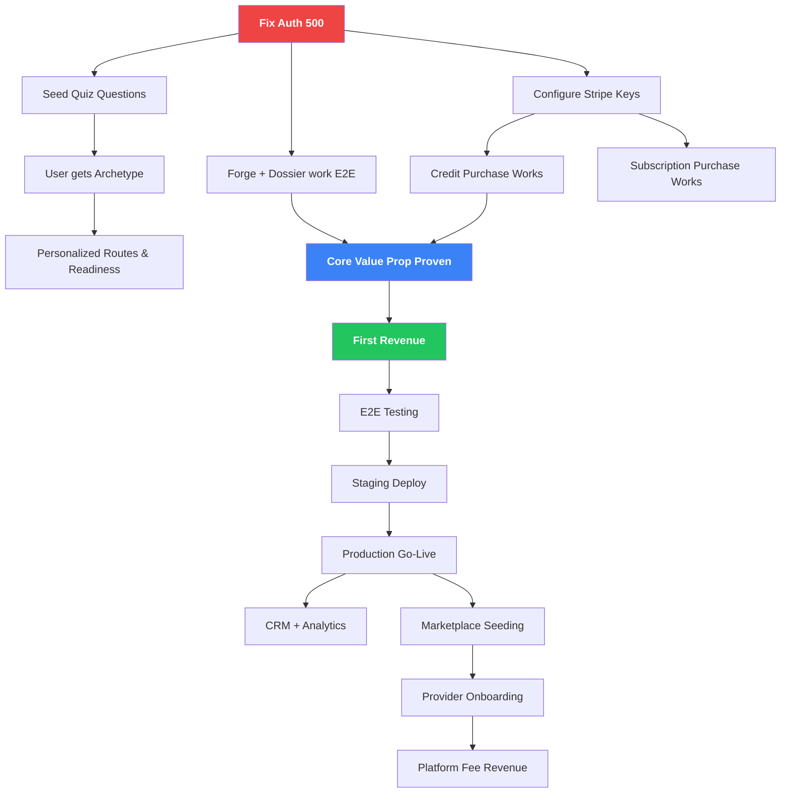

# Radiografia do Produto — Olcan Compass

**O que é**: An x-ray of every stakeholder flow through actual code, identifying where
reality breaks. Unlike Verdade_do_Produto (which catalogs what's built), this maps
what each *person* can actually do end-to-end.

**Criado**: 2026-04-21
**Método**: Code trace through frontend pages → stores → API client → backend routes → DB

---

## I. Stakeholder Map



**Every stakeholder is blocked by the same gate: Auth returns 500 in production.**

---

## II. End User Journey (the product's reason to exist)

The user is a professional navigating international mobility — looking for clarity,
documents, and readiness assessment.

### Critical Path: Register → Quiz → Forge → Dossier → Export

| # | Step | Frontend Page | API Endpoint | Store | Status |
|---|------|--------------|-------------|-------|--------|
| 1 | Register | `(auth)/register` | `POST /api/auth/register` | auth | 🔴 500 |
| 2 | Login | `(auth)/login` | `POST /api/auth/login` | auth | 🔴 500 |
| 3 | OIOS Quiz | `onboarding/quiz` | `POST /api/psych/sessions/start` | psych | ⚠️ Needs DB seeding |
| 4 | View Archetype | `profile/psych/results` | `GET /api/psych/profile` | psych | ✅ Code exists |
| 5 | Create Route | `routes/new` | `POST /api/routes` | routes | ✅ Code exists |
| 6 | Create Doc (Forge) | `forge/new` | `POST /api/v1/documents` | forge | ✅ Code exists |
| 7 | AI Polish | `forge/[id]` | `POST /api/forge/{id}/polish` | forge | ⚠️ Needs AI keys |
| 8 | Build Dossier | `dossiers/page` | `POST /api/v1/dossiers` | dossier | ✅ Code exists |
| 9 | Export Dossier | `dossiers/[id]/export` | Frontend-only (DOCX lib) | dossier+forge | ✅ Works locally |
| 10 | Buy Credits | `settings/billing` | `POST /api/billing/checkout` | — | ⚠️ Needs Stripe keys |
| 11 | Practice Interview | `interviews/new` | `POST /api/interview/sessions` | interviews | ✅ Code exists |
| 12 | Track Applications | `applications/new` | `POST /api/application` | applications | ✅ Code exists |
| 13 | View Readiness | `readiness/page` | Computed from stores | psych+sprints+routes | ✅ Frontend-only |

### Verdict: Zero end-to-end flows work

Steps 1-2 block everything. Even with auth fixed:
- Step 3 needs `psych_questions` table seeded (currently empty)
- Step 7 needs `OPENAI_API_KEY` or `GOOGLE_AI_KEY` configured
- Step 10 needs `STRIPE_SECRET_KEY` + `STRIPE_WEBHOOK_SECRET`

### What a user COULD do (with auth + quiz seeding):
- Register → Take OIOS quiz → Get archetype → Create route → Create documents in Forge →
  Build dossier → Export DOCX — **this is the core value prop and it's ~90% built**

---

## III. CEO / Business Owner Perspective

The CEO needs: users signing up, revenue flowing, and operational metrics.

| Need | Implementation | Status |
|------|---------------|--------|
| User signups | `/api/auth/register` | 🔴 Broken |
| Revenue from credits | `billing.py` → Stripe Checkout | ⚠️ Code ready, no Stripe keys |
| Revenue from subscriptions | `billing.py` → Stripe subscription | ⚠️ Code ready, no Stripe price IDs |
| User analytics | `analytics.py` → product events, A/B | ✅ Endpoints exist |
| CRM sync | `crm.py` → Twenty/Mautic | ⚠️ Twenty not configured |
| Platform metrics | `admin/page.tsx` → KPI dashboard | 🟡 Reads from stores (local state, not real DB) |
| Provider marketplace cut | 15% fee in `marketplace.py` | 🔴 No providers, no bookings |

### Revenue model in code:
```
Free tier: 3 forge credits, 1 route, basic quiz
Navegador (R$79/mês): Unlimited AI, 3 routes, interviews, marketplace
Comandante (R$149/mês): Everything + coach, unlimited routes, early access
Credit packs: 10 credits R$9, 50 credits R$39
```

### Verdict: Zero revenue capability
Stripe keys missing. No real users. The code IS built — `billing.py` has complete
Checkout Session creation, webhook handling, credit ledger, and subscription lifecycle.
But the config gap makes it all inert.

---

## IV. Provider / Vendor Perspective

Providers are mentors, immigration lawyers, translators who list services on the marketplace.

| Step | Frontend | Backend | Status |
|------|----------|---------|--------|
| Register as Provider | `(auth)/register/provider` | `POST /api/auth/register` | 🔴 Auth broken |
| Provider Onboarding | `provider/onboarding` | marketplace routes | 🟡 Page exists |
| List Services | `provider/services` | `POST /api/marketplace/services` | ✅ Backend exists (1599-line file) |
| View Bookings | `provider/bookings` | `GET /api/marketplace/bookings` | ✅ Backend exists |
| View Earnings | `provider/earnings` | Computed from bookings | 🟡 Frontend store-based |
| Receive Payout | — | Stripe Connect not implemented | 🔴 Missing |
| Messages | `marketplace/messages/[id]` | `GET /api/marketplace/conversations` | ✅ Backend exists |

### Provider Frontend Pages (6 total):
`provider/page`, `provider/bookings`, `provider/earnings`, `provider/onboarding`,
`provider/services`, `provider/settings`

### Verdict: Non-functional
Auth blocks entry. Even with auth, no Stripe Connect for payouts. The marketplace
backend (`marketplace.py` — 1599 lines) is the most complete non-auth backend file,
with full CRUD for providers, services, bookings, reviews, conversations, and escrow.
But zero seed data and no way to onboard a real provider.

---

## V. Organization Admin Perspective

B2B: companies/universities managing cohorts of users.

| Step | Frontend | Backend | Status |
|------|----------|---------|--------|
| Register Org | `(auth)/register/org` | org routes | 🔴 Auth broken |
| Invite Members | `org/members` | `/api/org/` | ✅ Routes exist |
| Track Cohorts | `org/cohorts` | ? | 🟡 Unclear backend |
| View Analytics | `org/analytics` | ? | 🟡 Page exists |

### Verdict: Non-functional (auth blocks). Lower priority — no B2B customers yet.

---

## VI. Platform Admin Perspective

Internal operations: moderate, monitor, manage.

| Tool | Frontend | Backend | Status |
|------|----------|---------|--------|
| User Management | `admin/users` | admin routes | ✅ Routes exist |
| Provider Verification | `admin/providers` | marketplace admin | ✅ Routes exist |
| Finance Dashboard | `admin/finance` | `billing/status` | ✅ Routes exist |
| Content Moderation | `admin/moderation` | ? | 🟡 Unclear |
| CRM Bridge | `admin/crm` | `/api/admin/crm/*` (Twenty/Mautic) | ⚠️ Twenty not configured |
| Analytics | `admin/analytics` | `/api/analytics/*` | ✅ Routes exist |
| AI Config | `admin/ai` | ? | 🟡 Unclear |
| Economics | `admin/economics-intelligence` | admin_economics routes | ✅ Routes exist |
| Observability | `admin/observability` | Sentry integration | ⚠️ Sentry DSN optional |

### Verdict: Backend routes mostly exist. But admin sees empty data until users exist.

---

## VII. Architecture Bugs & Confusion Vectors

### 🔴 Critical

1. **Auth 500 in production** — The singular blocker. Migration 0026 may not have run.
   Other User model columns may also be missing from the DB.

2. **`main.py` vs `main_real.py`** — TWO app entry points exist.
   - `main.py` is used in production (Dockerfile: `uvicorn app.main:app`)
   - `main_real.py` mounts a DIFFERENT set of routers (companions_real, documents_real, etc.)
   - These `*_real.py` files import from `app.api.*_real` which may not even exist
   - **Danger**: An agent could modify `main_real.py` thinking it's production

3. **Supabase dead code** — `lib/supabase/` (client.ts, server.ts, middleware.ts) is imported
   by `middleware.ts`. The project uses custom FastAPI JWT auth, NOT Supabase. This code
   does nothing (returns null when unconfigured) but adds confusion and a phantom CSP entry.

4. **Enhanced Forge mounted in production** — `v1/enhanced_forge.py` is registered in
   `v1/__init__.py` and its models exist (`app/models/enhanced_forge.py`). Migration
   `0025_enhanced_forge` created the tables. But this is the P3 feature from `.kiro/specs/`
   that we said should NOT be built yet. It's already partially deployed.

### 🟡 Structural Debt

5. **Dual API client** — `api.ts` (axios) and `api-client.ts` (fetch) coexist with ~40
   importers each. Neither is deprecated. New code should use `api-client.ts`.

6. **Route double-mounting** — Every route is mounted at BOTH `/api/*` and `/api/v1/*` via
   `router.py` lines 100-104. Then the v1 aggregate router adds ANOTHER `/v1/*` layer.
   Result: some endpoints accessible at 3 different paths.

7. **Frontend admin reads from Zustand stores** — `admin/page.tsx` computes KPIs from local
   Zustand state (forge docs, bookings, providers), NOT from real admin endpoints. This means
   the admin dashboard shows client-side state, not server truth.

8. **49 unused-import ESLint warnings** — Noise but not harmful.

### ⚪ Technical Debt (lower priority)

9. **Medusa tables hand-written** — 18 tables in `medusa` schema were created via raw SQL,
   not MedusaJS migrations. If MedusaJS ever starts, it will conflict.

10. **3 low-usage stores** (realtimeStore, economics, analyticsStore) — merge candidates.

---

## VIII. What Actually Works (If Auth Were Fixed)

### Tier 1 — Ready to work (needs only auth fix):
- Document Forge CRUD (create, edit, version, compare, export)
- Dossier CRUD + DOCX export (frontend-only export with `downloadDocx`)
- Route planning (create, milestones, timeline, risk)
- Application tracking (create, deadlines, calendar, watchlist)
- Sprint management (create, track tasks)
- Interview practice (session management, Q&A, feedback)
- Readiness scoring (computed from sprints + routes + psych)

### Tier 2 — Needs auth fix + seed data:
- OIOS Psychology Quiz (needs `psych_questions` rows in DB)
- Marketplace browsing (needs provider seed data)

### Tier 3 — Needs auth fix + API keys:
- AI Polish in Forge (needs OPENAI_API_KEY or GOOGLE_AI_KEY)
- Billing / Credits (needs STRIPE_SECRET_KEY, STRIPE_WEBHOOK_SECRET, price IDs)
- CRM sync (needs TWENTY_BASE_URL, TWENTY_API_KEY)

### Tier 4 — Facade / Incomplete:
- Aura AI companion — rule-based string matching (TODO: Vertex AI integration)
- Commerce proxy — depends on MedusaJS (not deployed)
- Gamification (guilds, quests, achievements) — models exist, no seed data, P3
- Social / Community — routes exist, zero content
- Enhanced Forge (process management) — P3, already accidentally deployed

---

## IX. Dependency Graph for Revenue



---

## X. Prioritized Action Plan for Agents

### Phase 0: Unblock (estimated: 1 session)
1. **Force-run migration** via `GET /api/migrate-db-render?secret_key=olcan2026omega`
2. **Check Render logs** for the actual 500 stack trace
3. **Verify all User model columns** exist in the production DB
4. **Test register + login** — if it works, everything in Tier 1 unlocks

### Phase 1a: Core Value (estimated: 1-2 sessions)
5. **Seed `psych_questions`** — write SQL or use seed endpoint
6. **Test full flow**: Register → Quiz → Archetype → Create Doc → Build Dossier → Export
7. **Remove Supabase dead code** from middleware and lib/
8. **Kill `main_real.py`** — it's a confusion vector, not used in production

### Phase 1b: Revenue (estimated: 1-2 sessions, needs CEO input)
9. **Configure Stripe keys** in Render env vars
10. **Create Stripe price IDs** for Navegador and Comandante plans
11. **Test billing flow**: Buy credits → Forge polish → Credit deducted
12. **Test subscription flow**: Subscribe → Plan changes → Webhook processed

### Phase 2: Harden (estimated: 2-3 sessions)
13. **Consolidate API clients** — deprecate `api.ts`, standardize on `api-client.ts`
14. **Fix admin dashboard** — wire to real backend endpoints, not store state
15. **E2E tests** for critical path (register → quiz → forge → dossier)
16. **Fix CI workflows** — both are broken (wrong paths, wrong Python version)

### Phase 3: Growth (only AFTER revenue works)
17. Marketplace provider seeding
18. CRM integration (Twenty/Mautic)
19. Gamification / Social features
20. Enhanced Forge process management

---

## XI. Files to Clean Up

| File | Problem | Action |
|------|---------|--------|
| `main_real.py` | Parallel entry point, confuses agents | Delete or move to `_GRAVEYARD/` |
| `lib/supabase/*` | Dead code, project uses custom auth | Delete 3 files |
| `middleware.ts` L2 | Imports dead Supabase module | Remove import |
| `middleware.ts` L86 | CSP allows `supabase.co` for no reason | Remove from CSP |
| `api.ts` | Legacy axios client, ~40 importers | Deprecate gradually |
| `v1/enhanced_forge.py` | P3 feature mounted in prod | Unmount from `v1/__init__.py` |

---

## Related Documents

- [[Verdade_do_Produto]] — Feature-level truth
- [[Agent_Knowledge_Handbook]] — Agent onboarding
- [[Backend_API_Audit_v2_5]] — Endpoint-level audit
- [[DEPLOYMENT_RENDER]] — How to deploy and debug on Render
- [[Grafo_de_Conhecimento_Olcan]] — Visual ecosystem map
